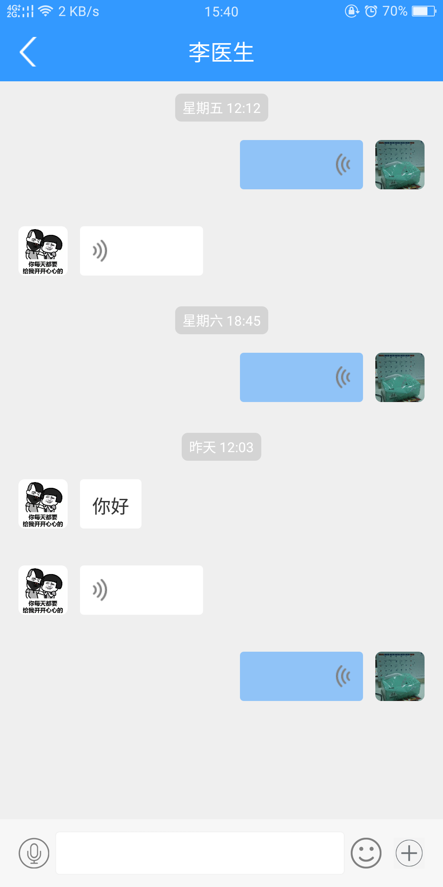
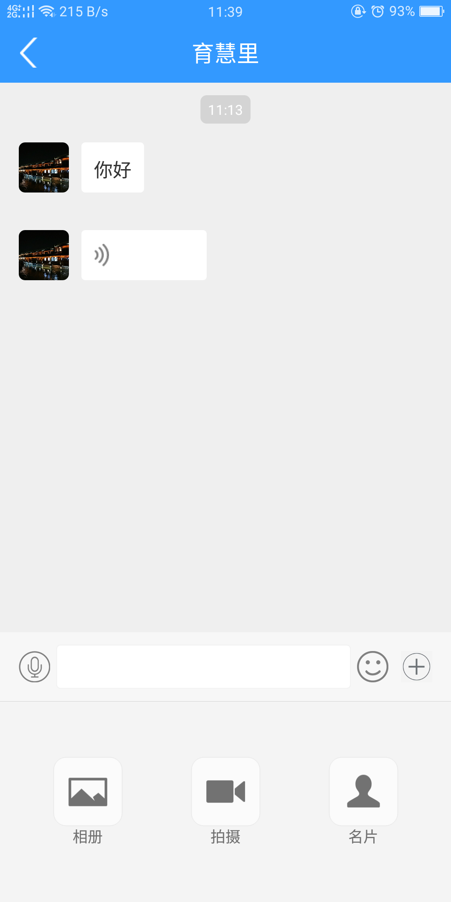
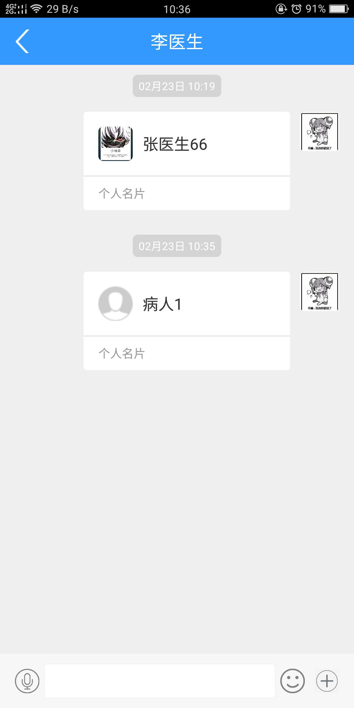
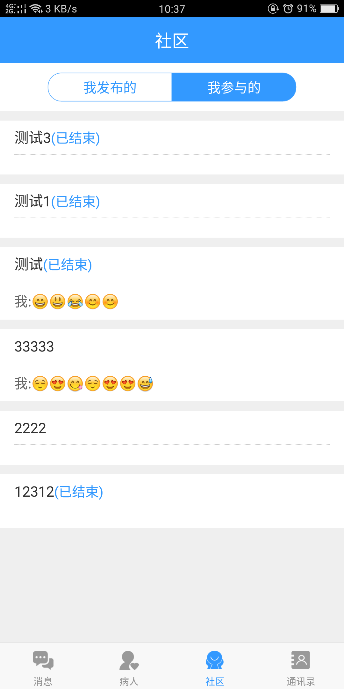
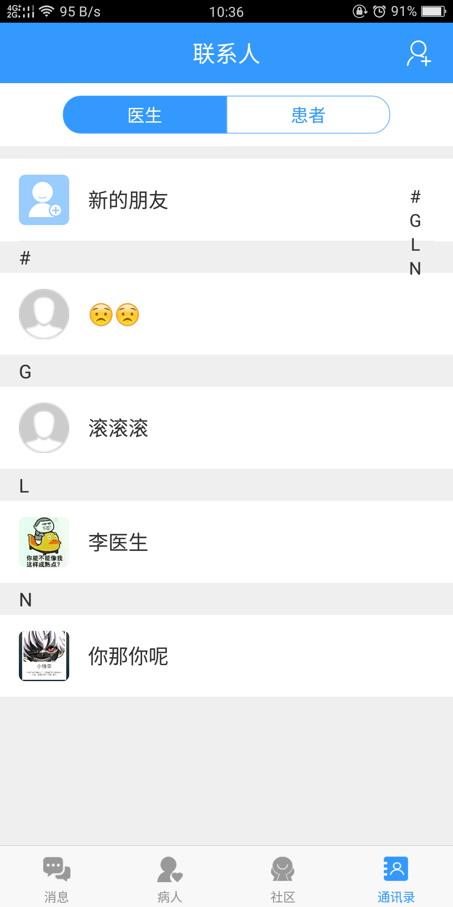
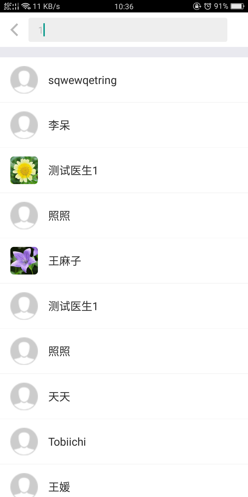

### 技术栈

前端React Native全家桶, 移动端数据库[Realm](https://github.com/realm/realm-js), 聊天通讯使用环信WebIM-SDK, 状态管理使用Redux,异步状态使用Redux-Thunk,热更新使用[React-Native-Update](https://github.com/reactnativecn/react-native-pushy#readme)。

### 已完成功能

- 账户

  - [x] 登录
  - [x] 注册
  - [x] 退出登录

- 私聊

  - [x] 私聊
  - [x] 添加联系人
  - [x] 好友资料展示
  - [x] 删除联系人

- 群聊

  - [x] 群聊 
  - [x] 建群
  - [x] 加群
  - [x] 群资料展示
  - [x] 退群：退群后聊天列表不再展示该群(DB中删除该关系)
  - [x] 编辑群资料

- 查询

  - [x] 用户搜索

- 丰富聊天方式
  - [x] 发图
  - [x] 发表情
  - [x] 发名片
  - [x] 图片放大查看
  - [x] 发语音

### 项目展示：

